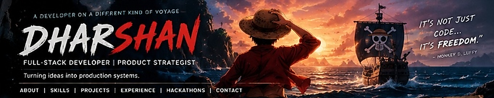
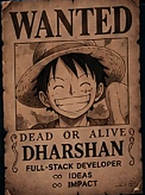
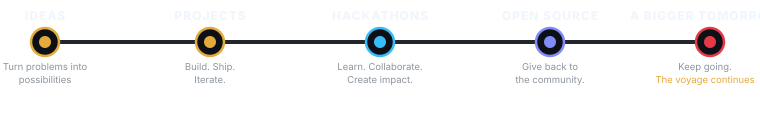
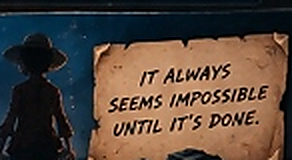
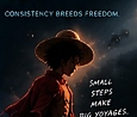
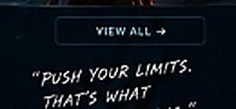
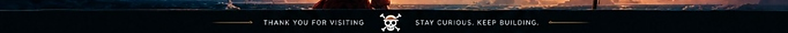

<!--
  =============================================================================
  DHARSHAN — GITHUB PROFILE README (ONE PIECE / MONKEY D. LUFFY CINEMATIC THEME)
  =============================================================================
-->

<div align="center" id="dharshan">

<!-- CINEMATIC HERO BANNER -->
<a href="https://github.com/Dharshan1120">
  
</a>

<!-- QUICK NAVIGATION DOCK -->
<p align="center">
  <a href="#-who-am-i"><kbd>&nbsp;ABOUT&nbsp;</kbd></a>&nbsp;&nbsp;•&nbsp;&nbsp;
  <a href="#-my-arsenal"><kbd>&nbsp;SKILLS&nbsp;</kbd></a>&nbsp;&nbsp;•&nbsp;&nbsp;
  <a href="#-bounty--projects"><kbd>&nbsp;PROJECTS&nbsp;</kbd></a>&nbsp;&nbsp;•&nbsp;&nbsp;
  <a href="#-grand-line"><kbd>&nbsp;JOURNEY&nbsp;</kbd></a>&nbsp;&nbsp;•&nbsp;&nbsp;
  <a href="#-github-stats"><kbd>&nbsp;STATS&nbsp;</kbd></a>&nbsp;&nbsp;•&nbsp;&nbsp;
  <a href="#-hackathon-mode"><kbd>&nbsp;HACKATHONS&nbsp;</kbd></a>&nbsp;&nbsp;•&nbsp;&nbsp;
  <a href="#-the-next-adventure-starts-here"><kbd>&nbsp;CONTACT&nbsp;</kbd></a>
</p>

<!-- DYNAMIC TYPING HEADER -->
<a href="https://github.com/Dharshan1120">
  
</a>

<br/>

<!-- VOYAGE TELEMETRY BADGES -->
<a href="https://github.com/Dharshan1120">
  
</a>
&nbsp;
<a href="https://github.com/Dharshan1120?tab=followers">
  
</a>
&nbsp;
<a href="https://github.com/Dharshan1120?tab=repositories">
  
</a>

</div>

<br/>

<!-- ========================================================================= -->
<!-- SECTION 1: WHO AM I?                                                      -->
<!-- ========================================================================= -->


<table width="100%" border="0" cellpadding="8" cellspacing="0">
<tr>
<td width="52%" valign="top">

### 🏴‍☠️ The Captain's Log

> *"I build real-world products, solve meaningful problems, and turn ideas into scalable systems. Deeply interested in AI, automation, and products that create real impact."*

I'm **Dharshan**, a Full-Stack Developer and Product Strategist based in **Coimbatore, Tamil Nadu, India**. Whether architecting end-to-end web applications, integrating autonomous AI agents, or designing robust backend microservices, my focus is always on engineering scalable, production-grade solutions.

<br/>

```yaml
voyager: Dharshan
role: Full-Stack Developer | Product Strategist
base_camp: Coimbatore, Tamil Nadu, India
status: Student & Active Builder
flagship_focus: Scalable Web Apps, AI Agents, Production Systems
```

<br/>

<p>
  
  
  
</p>

</td>
<td width="28%" valign="middle" align="center">


<sub><i>"If you have a dream, you should go for it." — Luffy</i></sub>

</td>
<td width="20%" valign="middle" align="center">

<a href="#dharshan">
  
</a>

</td>
</tr>
</table>

<br/>

<!-- ========================================================================= -->
<!-- SECTION 2: MY ARSENAL                                                     -->
<!-- ========================================================================= -->


<table width="100%" border="0" cellpadding="8" cellspacing="0">
<tr>
<td width="74%" valign="top">

<table width="100%" border="0" cellpadding="6" cellspacing="0">
<tr>
<td width="50%" valign="top">

#### ⚡ LANGUAGES

<br/>
<sub>`JavaScript` · `TypeScript` · `Python` · `Java` · `C/C++`</sub>

</td>
<td width="50%" valign="top">

#### 🎨 FRONTEND

<br/>
<sub>`React` · `Next.js` · `HTML5` · `CSS3` · `Tailwind CSS`</sub>

</td>
</tr>

<tr>
<td width="50%" valign="top">

#### ⚙️ BACKEND & APIS

<br/>
<sub>`Node.js` · `Express` · `REST APIs` · `GraphQL`</sub>

</td>
<td width="50%" valign="top">

#### 🗄️ DATABASES & STORAGE

<br/>
<sub>`PostgreSQL` · `MongoDB` · `MySQL` · `Neo4j` · `Redis`</sub>

</td>
</tr>

<tr>
<td width="50%" valign="top">

#### 🛠️ TOOLS & DEVOPS

<br/>
<sub>`Git` · `GitHub` · `Docker` · `AWS` · `Vercel`</sub>

</td>
<td width="50%" valign="top">

#### 🧠 AI / ML & AUTOMATION
<p>
  
  
  <br/>
  
  
</p>
<sub>`LLMs` · `AI Agents` · `RAG` · `Automation` · `OpenCV`</sub>

</td>
</tr>
</table>

</td>
<td width="26%" valign="middle" align="center">


<sub><i>"A man's dream will never die." — Luffy</i></sub>

</td>
</tr>
</table>

<br/>

<!-- ========================================================================= -->
<!-- SECTION 3: BOUNTY / PROJECTS                                              -->
<!-- ========================================================================= -->


<table width="100%" border="0" cellpadding="8" cellspacing="0">
<tr>
<td width="50%" valign="top">

<!-- MISSION 01 -->
<a href="https://github.com/Dharshan1120/smart-attendance-ai">
  
</a>

### 🎯 Smart Attendance AI
*AI-powered facial recognition automated attendance system.*

Eliminates manual roll calls and guarantees instantaneous identity verification in classrooms or office setups using real-time computer vision and facial embeddings.

`Python` `OpenCV` `Face Recognition` `AI Automation`

[🔗 View Repository](https://github.com/Dharshan1120/smart-attendance-ai) · [🐙 Star Project](https://github.com/Dharshan1120/smart-attendance-ai)

</td>
<td width="50%" valign="top">

<!-- MISSION 02 -->
<a href="https://github.com/Dharshan1120/ultron-voice-agent">
  
</a>

### 🎙️ Ultron Voice Agent
*Autonomous real-time conversational AI voice assistant.*

Engineered for seamless voice interactions with low-latency audio capture, streaming LLM completions, dynamic context memory, and intelligent speech synthesis.

`TypeScript` `Node.js` `LLMs` `WebSockets` `Audio Pipeline`

[🔗 View Repository](https://github.com/Dharshan1120/ultron-voice-agent) · [🐙 Star Project](https://github.com/Dharshan1120/ultron-voice-agent)

</td>
</tr>

<tr>
<td width="50%" valign="top">

<!-- MISSION 03 -->
<a href="https://github.com/Dharshan1120/edudata-sihfinal">
  
</a>

### 🏛️ EduData — SIH Finalist Platform
*Smart educational data & analytics system built for Smart India Hackathon.*

A full-stack governance and analytics intelligence engine streamlining educational resource monitoring, student progression metrics, and automated institutional reporting.

`TypeScript` `Next.js` `PostgreSQL` `Tailwind CSS`

[🔗 View Repository](https://github.com/Dharshan1120/edudata-sihfinal) · [🐙 Star Project](https://github.com/Dharshan1120/edudata-sihfinal)

</td>
<td width="50%" valign="top">

<!-- MISSION 04 -->
<a href="https://github.com/Dharshan1120/Solo-Leveling-System-main">
  
</a>

### ⚔️ Solo Leveling System
*Gamified real-life productivity and quest progression engine.*

Transforms daily habits, skill acquisition, and fitness milestones into an interactive RPG quest system inspired by the Solo Leveling anime and manhwa universe.

`JavaScript` `React` `Game Logic` `Web App`

[🔗 View Repository](https://github.com/Dharshan1120/Solo-Leveling-System-main) · [🐙 Star Project](https://github.com/Dharshan1120/Solo-Leveling-System-main)

</td>
</tr>
</table>

<div align="right">
  <a href="https://github.com/Dharshan1120?tab=repositories">
    <b>Explore All 11 Repositories on GitHub ➔</b>
  </a>
</div>

<br/>

<!-- ========================================================================= -->
<!-- SECTION 4: GRAND LINE (DEVELOPER JOURNEY)                                 -->
<!-- ========================================================================= -->


<table width="100%" border="0" cellpadding="8" cellspacing="0">
<tr>
<td width="72%" valign="middle">



<p align="center">
  <b>IDEAS</b>: Turn problems into possibilities &nbsp;➔&nbsp; 
  <b>PROJECTS</b>: Build. Ship. Iterate. &nbsp;➔&nbsp; 
  <b>HACKATHONS</b>: Learn & create impact &nbsp;➔&nbsp; 
  <b>A BIGGER TOMORROW</b>: Keep sailing
</p>

</td>
<td width="28%" valign="middle" align="center">



<sub><i>"It always seems impossible until it's done."</i></sub>

</td>
</tr>
</table>

<br/>

<!-- ========================================================================= -->
<!-- SECTION 5: GITHUB STATS & CONTRIBUTIONS                                   -->
<!-- ========================================================================= -->


<div align="center">

<table width="100%" border="0" cellpadding="4" cellspacing="0">
<tr>
<td width="75%" valign="top" align="center">

<!-- STATS CARDS ROW 1 -->
<p align="center">
  
  &nbsp;
  
</p>

<!-- STREAK STATS ROW 2 -->
<p align="center">
  
</p>

<!-- ACTIVITY GRAPH ROW 3 -->
<p align="center">
  
</p>

</td>
<td width="25%" valign="middle" align="center">



<sub><i>"Small steps make big voyages."</i></sub>

</td>
</tr>
</table>

</div>

<br/>

<!-- ========================================================================= -->
<!-- SECTION 6: HACKATHON MODE                                                 -->
<!-- ========================================================================= -->


<table width="100%" border="0" cellpadding="8" cellspacing="0">
<tr>
<td width="33%" valign="top">

#### 🏆 Smart India Hackathon (SIH)
*Problem Statement: Educational Data & Infrastructure Intelligence.*
<br/>
`TypeScript` `Next.js` `PostgreSQL` `Analytics`
<br/><br/>
🏅 **National Level Finalist (`edudata-sihfinal`)**

</td>
<td width="33%" valign="top">

#### ⚡ AI Automation Sprint
*Problem Statement: Automated Facial Biometrics Roll Calling.*
<br/>
`Python` `OpenCV` `Face Recognition` `Deep Learning`
<br/><br/>
🏅 **Working Production System (`smart-attendance-ai`)**

</td>
<td width="34%" valign="top">

#### 🎙️ Conversational Voice Hack
*Problem Statement: Ultra Low-Latency Voice AI Interaction.*
<br/>
`TypeScript` `Node.js` `LLM Streaming` `WebSockets`
<br/><br/>
🏅 **Autonomous Voice Engine (`ultron-voice-agent`)**

</td>
</tr>
</table>

<table width="100%" border="0" cellpadding="4" cellspacing="0">
<tr>
<td width="70%" valign="middle">

> *"In the heat of a hackathon, clean architecture meets rapid execution. When the problem is real, I build."*

</td>
<td width="30%" valign="middle" align="center">



</td>
</tr>
</table>

<br/>

<!-- ========================================================================= -->
<!-- SECTION 7: CURRENTLY BUILDING & NEXT ADVENTURE                            -->
<!-- ========================================================================= -->


<table width="100%" border="0" cellpadding="8" cellspacing="0">
<tr>
<td width="42%" valign="top">

### 🧭 New Islands. New Challenges.

- 🛠️ **Building:** `Smart Attendance AI` & `Ultron Voice Agent`
- 📚 **Learning:** `Graph Databases (Neo4j), System Design & Agentic Architectures`
- 🔬 **Exploring:** `Autonomous LLM Workflows, Distributed Cloud & DevTools`
- 🤝 **Looking for:** `High-impact engineering collaborations & product teams`

<br/>

<div align="center">
  
</div>

</td>
<td width="58%" valign="middle" align="center">

<!-- CINEMATIC NEXT ADVENTURE FINALE -->
<a href="#-the-next-adventure-starts-here">
  
</a>

</td>
</tr>
</table>

<br/>

<!-- ========================================================================= -->
<!-- SECTION 8: CONTACT DOCK                                                   -->
<!-- ========================================================================= -->
<div align="center" id="-the-next-adventure-starts-here">

## 🏴‍☠️ The Next Adventure Starts Here

### *"Let's build something worth shipping."*

<p align="center">
  <a href="https://linkedin.com" target="_blank">
    
  </a>
  &nbsp;&nbsp;
  <a href="https://github.com/Dharshan1120" target="_blank">
    
  </a>
  &nbsp;&nbsp;
  <a href="mailto:dharshansmd@gmail.com">
    
  </a>
</p>

<br/>

<!-- CINEMATIC FOOTER BANNER -->


</div>
